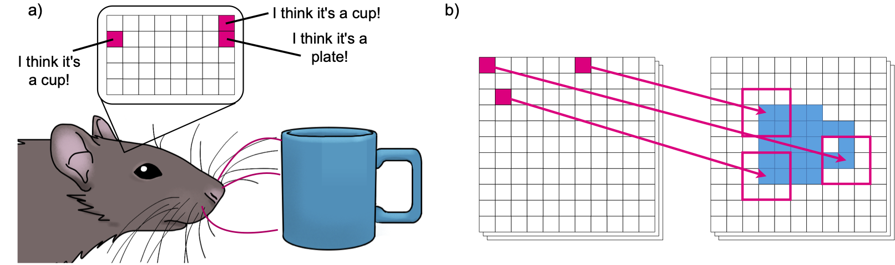

# Movement Drives Emergent Attention and Scalability in Active Neural Cellular Automata

The brain has inspired many interesting artificial intelligence (AI) systems, especially through the distributed columnar architecture of the neocortex. However, as most AI systems rely on static input, the importance of active sensing is often overlooked. In animals, sensing is an active process, where perception depends on motor control. To explore how sensorimotor control impacts behavior in classification tasks, we introduce the Active Neural Cellular Automata (ANCA), a neocortex-inspired model with movable sensors. Active sensing naturally emerges in the ANCA, with belief-informed exploration and attentive behavior to salient information, without adding explicit attention mechanisms. Active sensing both simplifies classification tasks and leads to a highly scalable system. This enables ANCAs to be smaller than the image size without losing information and enables fault tolerance to damaged sensors. Overall, our work provides insight to how distributed architectures can interact with movement, opening new avenues for adaptive AI systems in embodied agents.



## Code structure

The configuration for experiments are given in "config" files. To run an experiment with the current config, run 

```python
python3 main.py
```

There are several flags to modify the output of main.py, f.ex. "-s" will allow you to save. With this option, a folder "experiments" will be made in the folder, and a sub-folder will be added that contains your results. All sub-folder names are unique. 

To play an animation of a trained ANCA:
```python
python3 main.py -tp path/to/your/experiment/folder -c path/to/your/experiment/folder/config -v -vn N
```
where N is the amount of samples you want to see an animation for, and "-v" signfies visualization. 

To plot the results from any result folder, run 

```python
python3 plot_runs.py path/to/your/experiment/folder
```

Path can be absolute or relative. 

The folder "src" contains the functionality used in main.py. Most notably, "active_nca.py" contains the class of the new system. But keep in mind that how to train the system lies in main.py. 

## Authors

Mia-Katrin Kvalsund, Kai Olav Ellefsen, Kyrre Glette, Sidney Pontes-Filho, Mikkel Elle Lepperød

Code mainly produced by: Mia-Katrin Kvalsund

Some of Sidney Pontes-Filho's code is also used from this project: [Neural Cellular Robot Substrate](https://github.com/sidneyp/neural-cellular-robot-substrate)

## The folder structure:
```
.
├── experiments                                  Example experiment folder
│   ├── anca_run_folder                          ANCA superfolders (per experiment)
│   │   ├── run_nr_X_folder                      A specific run, labelled by time and date
│   │   ├── folder data                          Specific data about all the runs in this folder (such as accuracy, scalability, etc.)
│   ├── cnn_superfolder                          CNN experiments
│   │   ├── cnn_run_folder                       CNN superfolder (per experiment)
│   │   │   ├── run_nr_X_folder                  A specific run, labelled by time and date
│   │   │   ├── folder data                      Specific data about all the runs in this folder (such as accuracy, scalability, etc.)
│   ├── vit_superfolder                          ViT experiments
│   │   ├── vit_run_folder                       ViT superfolder (per experiment)
│   │   │   ├── run_nr_X_folder                  A specific run, labelled by time and date
│   │   │   ├── folder data                      Specific data about all the runs in this folder (such as accuracy, scalability, etc.)
├── src
│   ├── active_nca.py                            The ActiveNCA and supporting functions
│   ├── animate.py                               The animation function used when visualizing from main
│   ├── data_processing.py                       Data loading and pre-processing
│   ├── logger.py                                The Logger object for logging runs
│   ├── loss.py                                  All loss and accuracy metrics
│   ├── perception_matrix.py                     The perception matrix init / mapping from substrate to image
│   ├── plotting_utils.py                        Utils for plotting in test scripts
│   └── utils.py                                 Utils for src and main
├── tests                                        Various tests
│   ├── test_loss.py
│   ├── test_moving_nca.py
│   ├── test_perception_matrix.py
│   ├── thinking_about_loss_energy.py
│   ├── thinking_about_normalized_positions.py      
│   └── thinking_about_plt_Rectangle.py
├── cnn.py                                       All code to do with CNN data generation
├── common_funcs.py                              Funcs for many test-scripts
├── config                                       Example config
├── img                                          Image folder
├── inspect_focus.py                             File used to generate active sensing plots
├── main.py                                      Train, test and visualize
├── plot_runs.py                                 Plot one run
├── plot_tuning.py                               Plot a folder of runs 
├── print_stats.py                               Print stats (accuracy, loss) for a folder of runs
├── requirements.txt                             Requirements for MacOS
├── requirements_linux.txt                       Likewise, Linux
├── vit.py                                       All code to do with ViT data generation
├── zero_shot_damage.py                          Used to test fault tolerance/robustness
├── zero_shot_robustness_vs_scalability.py       Used to plot robustness versus scalability
└── zero_shot_scalability.py                     Used to test scalability
```

