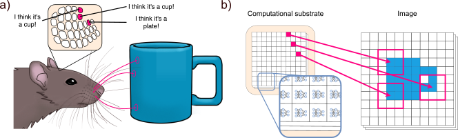

# Movement Drives Emergent Attention and Scalability in Active Neural Cellular Automata

The brain has inspired many interesting artificial intelligence (AI) systems, especially through the distributed columnar architecture of the neocortex. However, as most AI systems rely on static input, the importance of active sensing is often overlooked. In animals, sensing is an active process, where perception depends on motor control. To explore how sensorimotor control impacts behavior in classification tasks, we introduce the Active Neural Cellular Automata (ANCA), a neocortex-inspired model with movable sensors. Active sensing naturally emerges in the ANCA, with belief-informed exploration and attentive behavior to salient information, without adding explicit attention mechanisms. Active sensing both simplifies classification tasks and leads to a highly scalable system. This enables ANCAs to be smaller than the image size without losing information and enables fault tolerance to damaged sensors. Overall, our work provides insight to how distributed architectures can interact with movement, opening new avenues for adaptive AI systems in embodied agents.



## Code structure

The configuration for experiments are given in "config" files. To run an experiment with the current config, run 

```python
python3 main.py
```

There are several flags to modify the output of main.py, f.ex. "-s" will allow you to save. With this option, a folder "experiments" will be made in the folder, and a sub-folder will be added that contains your results. All sub-folder names are unique. 

To plot the results from any result folder, run 

```python
python3 plot_runs.py path/to/your/experiment/folder
```

Path can be absolute or relative. 

The folder "src" contains the functionality used in main.py. Most notably, "moving_nca.py" contains the class of the new system. But keep in mind that how to train the system lies in main.py. 

The script zero_shot_scalability.py is currently outdated. TODO. 

## Authors

Mia-Katrin Kvalsund, Kai Olav Ellefsen, Kyrre Glette, Sidney Pontes-Filho, Mikkel Elle Lepperød

Code mainly produced by: Mia-Katrin Kvalsund

Some of Sidney Pontes-Filho's code is also used from this project: [Neural Cellular Robot Substrate](https://github.com/sidneyp/neural-cellular-robot-substrate)


